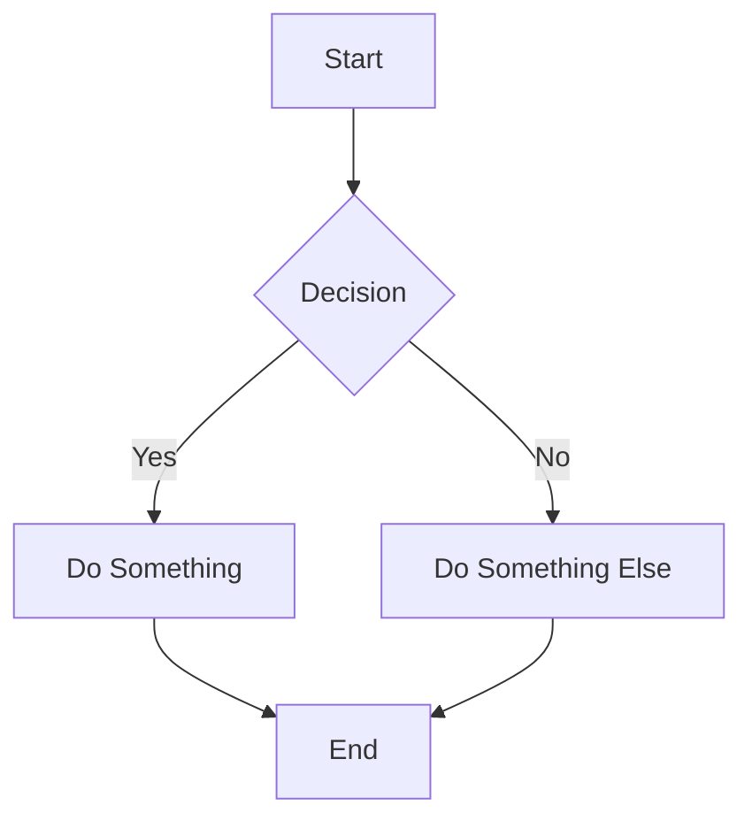
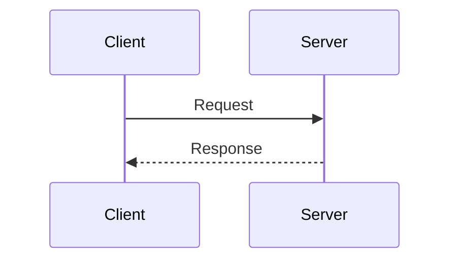
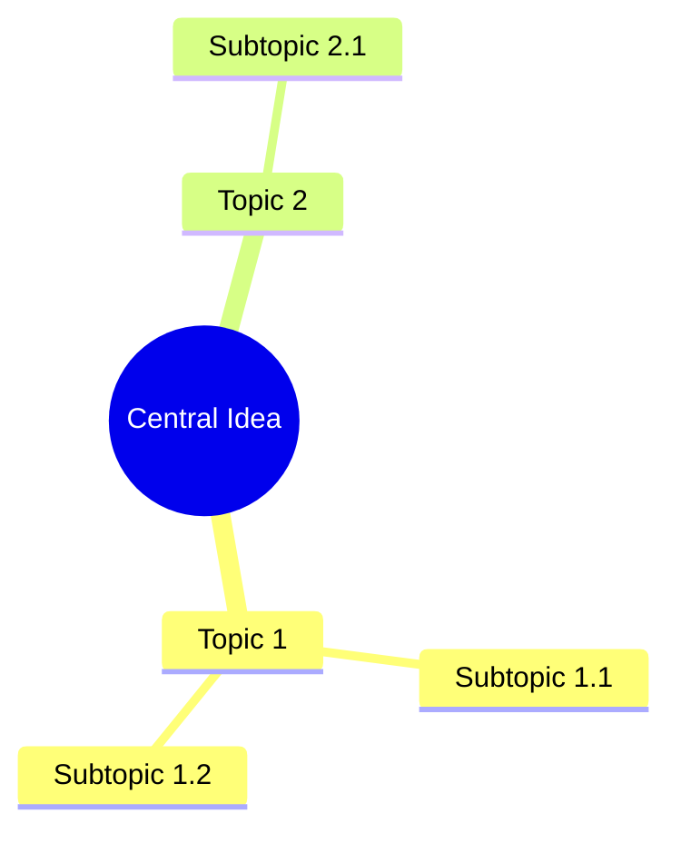
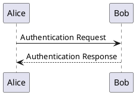
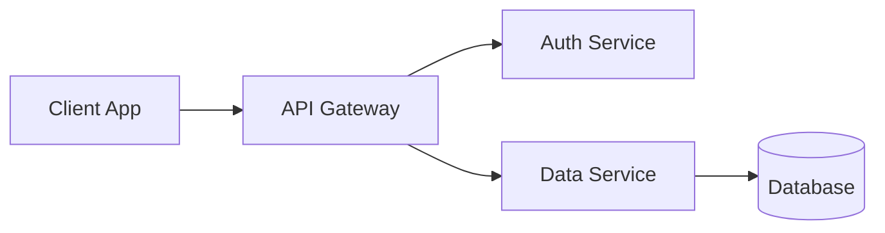

# Slidev Technical Slide Guide

This guide provides comprehensive patterns and best practices for creating technical presentations with Slidev.

## Table of Contents

1. [Introduction & Setup](#introduction--setup)
2. [Slide Structure Fundamentals](#slide-structure-fundamentals)
3. [Layout Patterns](#layout-patterns)
4. [Code Presentation](#code-presentation)
5. [Interactive Elements](#interactive-elements)
6. [Content Components](#content-components)
7. [Styling Techniques](#styling-techniques)
8. [Special Content](#special-content)
9. [Presenter Features](#presenter-features)
10. [Advanced Patterns](#advanced-patterns)
11. [Best Practices & Examples](#best-practices--examples)

---

## Introduction & Setup

### Basic Slidev Structure

Slidev presentations are written in Markdown with YAML frontmatter. Each slide is separated by `---`.

```markdown
---
# Global frontmatter
theme: default
title: My Presentation
---

# First Slide

Content here

---

# Second Slide

More content
```

### Essential Frontmatter Configuration

**Global Settings (at top of slides.md):**

```yaml
---
theme: default
title: Presentation Title
info: |
  ## Presentation Description
  Additional metadata
class: text-center
highlighter: shiki
drawings:
  persist: false
transition: slide-left
mdc: true
overviewSnapshots: true
---
```

**Common Options:**

- `theme`: Visual theme (default, seriph, etc.)
- `title`: Presentation title
- `highlighter`: Code highlighter (shiki or prism)
- `transition`: Default slide transition (slide-left, slide-up, fade, etc.)
- `mdc`: Enable MDC (Markdown Components) syntax
- `class`: Global CSS classes
- `drawings`: Persist drawings between reloads
- `overviewSnapshots`: Enable slide overview snapshots

### Per-Slide Frontmatter

```markdown
---
layout: center
transition: fade
level: 1
class: text-center
---
```

**Common Per-Slide Options:**

- `layout`: Slide layout template
- `transition`: Override global transition
- `level`: Heading level for navigation
- `class`: CSS classes for the slide
- `clicks`: Number of click steps
- `hideInToc`: Hide from table of contents

---

## Slide Structure Fundamentals

### Basic Slide Syntax

```markdown
---
# First slide (no separator needed)
---

# Second Slide

Content

---

# Third Slide

More content
```

### Slide Hierarchy

Use `level` to create hierarchical navigation:

```markdown
---
level: 1
---

# Chapter 1

---
level: 2
---

## Section 1.1

---
level: 2
---

## Section 1.2

---
level: 1
---

# Chapter 2
```

### Multi-Column Layouts

```markdown
---
layout: two-cols
layoutClass: gap-16
---

# Left Column

Content for left side

::right::

# Right Column

Content for right side
```

---

## Layout Patterns

Slidev provides several built-in layouts:

### Default Layout

```markdown
---
layout: default
---

# Title

Regular content
```

### Center Layout

```markdown
---
layout: center
class: text-center
---

# Centered Content

Everything is centered
```

### Two Columns Layout

```markdown
---
layout: two-cols
layoutClass: gap-16
---

# Left Side

- Point 1
- Point 2

::right::

# Right Side

- Point A
- Point B
```

### Image Right Layout

```markdown
---
layout: image-right
image: /path/to/image.png
---

# Content on Left

The image appears on the right
```

### Cover Layout

```markdown
---
layout: cover
background: /background.jpg
---

# Presentation Title

Subtitle
```

### Custom Layout Classes

```markdown
---
layoutClass: gap-4 grid grid-cols-2
---

Content will be arranged in a 2-column grid with small gaps
```

---

## Code Presentation

### Basic Code Blocks

````markdown
```typescript
function hello(name: string) {
  console.log(`Hello, ${name}!`);
}
```
````

### Code with Filename

````markdown
```typescript {file: 'hello.ts'}
function hello(name: string) {
  console.log(`Hello, ${name}!`);
}
```
````

### Line Highlighting

Highlight specific lines:

````markdown
```typescript {2-3}
function hello(name: string) {
  // This line is highlighted
  console.log(`Hello, ${name}!`); // This too
}
```
````

### Progressive Line Highlighting

Reveal different lines on each click:

````markdown
```typescript {2|3|all}
function hello(name: string) {
  // Click 1: Show this line
  console.log(`Hello, ${name}!`); // Click 2: Show this line
  // Click 3: Show all
}
```
````

### TwoSlash Integration

Show TypeScript type information on hover:

````markdown
```ts twoslash
interface User {
  name: string
}
const user: User = { name: "Alice" }
//    ^?
```
````

### Shiki Magic Move

Animate code transformations between slides:

````markdown
---
clicks: 3
---

# Code Evolution

````md magic-move
```typescript
// Step 1: Initial code
let count = 0
```

```typescript
// Step 2: Add function
let count = 0
function increment() {
  count++
}
```

```typescript
// Step 3: Add type
let count: number = 0
function increment(): void {
  count++
}
```
````
````

### Monaco Editor

Editable and executable code:

````markdown
```ts {monaco}
console.log('Editable TypeScript code')
```

```ts {monaco-run}
console.log('Editable and executable code')
```
````

### External Code Snippets

Import code from files:

```markdown
<<< @/path/to/file.ts

<!-- With line highlighting -->
<<< @/path/to/file.ts#snippet-name {2-5}

<!-- With specific lines -->
<<< @/path/to/file.ts#L10-L20
```

---

## Interactive Elements

### v-click - Progressive Reveal

Show elements one by one on each click:

```markdown
- Item 1
- <v-click>Item 2 (appears on click)</v-click>
- <v-click>Item 3 (appears on next click)</v-click>

<v-click>

Entire blocks can be wrapped too

</v-click>
```

**With Custom Click Numbers:**

```markdown
<v-click at="2">Appears on second click</v-click>
<v-click at="1">Appears on first click</v-click>
```

### v-mark - Inline Highlighting

Highlight text inline:

```markdown
This is <v-mark color="red">important text</v-mark> to highlight.

<v-mark color="blue" type="circle">Circle this</v-mark>

<v-mark type="underline">Underline this</v-mark>
```

**Available Types:**
- `color`: red, blue, green, yellow, orange, purple, pink
- `type`: circle, underline, box, highlight, strike-through

### v-motion - Motion Animations

Animate elements with motion:

```markdown
<div v-motion :initial="{ x: -100 }" :enter="{ x: 0 }">
  Slides in from left
</div>

<div v-motion :initial="{ opacity: 0, scale: 0.5 }" :enter="{ opacity: 1, scale: 1, transition: { delay: 500 } }">
  Fades in and scales up
</div>
```

### v-drag - Draggable Elements

Make elements draggable:

```markdown
<v-drag text-3xl>
  <carbon:draggable class="text-green-500" />
  Drag me around!
</v-drag>

<v-drag pos="200,150" w="300" h="80">
  <div bg-green-500 p-4>
    Positioned draggable box
  </div>
</v-drag>
```

**Options:**
- `pos="x,y"`: Initial position
- `w="width"` / `h="height"`: Dimensions

### Arrow Components

Draw arrows between elements:

```markdown
<Arrow x1="100" y1="100" x2="300" y2="200" />

<Arrow v-click x1="400" y1="100" x2="600" y2="300" color="red" width="2" />
```

---

## Content Components

### Table of Contents

```markdown
<Toc />

<!-- With custom settings -->
<Toc minDepth="1" maxDepth="2" />
```

### Tweet Embed

```markdown
<Tweet id="1234567890" />

<!-- With specific conversation -->
<Tweet id="1234567890" conversation="none" />
```

### Counter

Simple click counter:

```markdown
<Counter :count="5" />
```

### Grid Layouts

Create multi-column layouts:

```markdown
<div class="grid grid-cols-2 gap-4">
  <div>Column 1</div>
  <div>Column 2</div>
</div>

<div class="grid grid-cols-3 gap-8">
  <div>Column 1</div>
  <div>Column 2</div>
  <div>Column 3</div>
</div>
```

### Custom Vue Components

Place components in `./components/`:

```vue
<!-- components/MyComponent.vue -->
<template>
  <div>{{ message }}</div>
</template>

<script setup>
const message = "Hello from component"
</script>
```

Use in slides:

```markdown
<MyComponent />
```

---

## Styling Techniques

### Scoped Slide Styles

Add styles to specific slides:

```markdown
# My Slide

Content here

<style scoped>
h1 {
  color: #3b82f6;
  font-size: 3rem;
}
</style>
```

### UnoCSS Utility Classes

Slidev includes UnoCSS by default:

```markdown
<div class="text-4xl font-bold text-blue-500 mt-8">
  Large bold blue text
</div>

<div class="bg-gradient-to-r from-purple-500 to-pink-500 p-8 rounded-lg">
  Gradient background box
</div>
```

**Common Utilities:**
- Text: `text-{size}`, `font-{weight}`, `text-{color}`
- Spacing: `m-{size}`, `p-{size}`, `gap-{size}`
- Layout: `flex`, `grid`, `items-center`, `justify-between`
- Background: `bg-{color}`, `bg-opacity-{value}`
- Borders: `border`, `border-{size}`, `rounded-{size}`

### Gradient Text Effects

```markdown
<div class="text-6xl font-bold bg-gradient-to-r from-blue-500 to-purple-500 bg-clip-text text-transparent">
  Gradient Text
</div>
```

### Custom CSS Classes

Define global styles in `./styles/index.css`:

```css
.my-custom-class {
  background: linear-gradient(45deg, #667eea 0%, #764ba2 100%);
  padding: 2rem;
  border-radius: 1rem;
}
```

---

## Special Content

### LaTeX Math

**Inline Math:**

```markdown
The formula is $E = mc^2$ where...
```

**Block Math:**

```markdown
$$
\frac{d}{dx} \int_a^x f(t)dt = f(x)
$$
```

### Mermaid Diagrams

**Flowchart:**

````markdown

````

**Sequence Diagram:**

````markdown

````

**Mindmap:**

````markdown

````

### PlantUML Diagrams

````markdown

````

### Tables

```markdown
| Feature | Status |
|---------|--------|
| Code highlighting | ✓ |
| Interactive elements | ✓ |
| Diagrams | ✓ |
```

### Lists

```markdown
- Unordered item 1
- Unordered item 2
  - Nested item

1. Ordered item 1
2. Ordered item 2
   1. Nested ordered item
```

---

## Presenter Features

### Basic Slide Notes

Add notes visible only in presenter mode:

```markdown
# Slide Title

Slide content

---

These are presenter notes. Press `P` to enter presenter mode.
```

### Click-Synced Notes

Notes that change with click progression:

```markdown
# Progressive Content

<v-clicks>

- Point 1
- Point 2
- Point 3

</v-clicks>

---

[click] Explain point 1
[click] Explain point 2
[click] Explain point 3
```

### Rich HTML Notes

```markdown
# Slide

Content

---

<div class="grid grid-cols-2 gap-4">
  <div>
    <h3>Key Points</h3>
    <ul>
      <li>Point 1</li>
      <li>Point 2</li>
    </ul>
  </div>
  <div>
    <h3>Examples</h3>
    <code>const x = 1;</code>
  </div>
</div>
```

### Presenter Mode Shortcuts

- `P`: Enter presenter mode
- `O`: Toggle overview
- `G`: Go to slide
- `F`: Toggle fullscreen
- `D`: Toggle dark mode

---

## Advanced Patterns

### Importing External Slides

```markdown
---
src: ./pages/introduction.md
---

---
src: ./pages/features.md
---
```

### Custom Frontmatter Data

Access custom data in slides:

```markdown
---
customData:
  author: John Doe
  version: 1.0
---

# Title

Author: {{ $frontmatter.customData.author }}
```

### Programmatic Navigation

```markdown
<button @click="$nav.next()">Next Slide</button>
<button @click="$nav.prev()">Previous Slide</button>
<button @click="$nav.go(5)">Go to Slide 5</button>
```

### Global Layers

Create persistent elements across slides in `./global-top.vue` or `./global-bottom.vue`:

```vue
<!-- global-top.vue -->
<template>
  <div class="fixed top-4 right-4 text-sm opacity-50">
    {{ $page }}/{{ $total }}
  </div>
</template>
```

### Theme Customization

Override theme styles in `./styles/index.css`:

```css
:root {
  --slidev-theme-primary: #3b82f6;
}

.slidev-layout {
  padding: 2rem;
}
```

---

## Best Practices & Examples

### Effective Slide Progression

**Progressive Disclosure Pattern:**

```markdown
# Feature Overview

<v-clicks>

- **Core Feature**: The main capability
- **Advanced Usage**: Power user features
- **Integration**: How it connects with other tools

</v-clicks>

<v-click>

## Result

Comprehensive understanding in digestible chunks

</v-click>
```

### Balancing Content and Animation

**Good Example:**

```markdown
# Docker Architecture

<v-clicks>

- **Images**: Read-only templates
- **Containers**: Running instances
- **Registry**: Image storage

</v-clicks>

<v-click>

```yaml
version: '3'
services:
  web:
    image: nginx
```

</v-click>
```

**Avoid:**
- Too many animations (more than 5-6 clicks per slide)
- Animating every single word
- Complex nested animations

### Code Presentation Tips

**Show Evolution, Not Just Final Code:**

````markdown
---
clicks: 2
---

# Building the Function

````md magic-move
```typescript
// Start simple
function greet(name) {
  return `Hello, ${name}`
}
```

```typescript
// Add types
function greet(name: string): string {
  return `Hello, ${name}`
}
```

```typescript
// Add validation
function greet(name: string): string {
  if (!name) throw new Error('Name required')
  return `Hello, ${name}`
}
```
````
````

### Common Use Cases

**Technical Tutorial Slide:**

```markdown
---
layout: two-cols
---

# Docker Commands

## Basic Operations

```bash
docker build -t myapp .
docker run -p 8080:80 myapp
docker ps
docker stop <container>
```

::right::

<v-clicks>

1. **Build**: Creates image from Dockerfile
2. **Run**: Starts container from image
3. **PS**: Lists running containers
4. **Stop**: Halts container

</v-clicks>
```

**Architecture Diagram Slide:**

```markdown
---
layout: center
---

# System Architecture



<v-click>

Microservices with centralized gateway

</v-click>
```

**Comparison Slide:**

```markdown
# Before vs After

<div class="grid grid-cols-2 gap-8">
  <div>
    <h3 class="text-red-500">Before</h3>

```javascript
// Complex nested callbacks
getData((data) => {
  processData(data, (result) => {
    saveResult(result, () => {
      console.log('Done!')
    })
  })
})
```

  </div>
  <div>
    <h3 class="text-green-500">After</h3>

```javascript
// Clean async/await
const data = await getData()
const result = await processData(data)
await saveResult(result)
console.log('Done!')
```

  </div>
</div>
```

### Accessibility Tips

1. **Use Semantic Headings**: Maintain proper heading hierarchy
2. **Alt Text for Images**: Always provide descriptions
3. **Sufficient Contrast**: Ensure text is readable
4. **Keyboard Navigation**: Test all interactive elements
5. **Readable Font Sizes**: Minimum 24px for body text

### Performance Tips

1. **Optimize Images**: Use WebP format, compress files
2. **Limit Animations**: Don't overuse v-motion
3. **Code Splitting**: Use external imports for large code
4. **Lazy Loading**: Import heavy components conditionally
5. **Snapshot Overview**: Enable `overviewSnapshots: true`

---

## Quick Reference

### Essential Syntax Cheatsheet

```markdown
# Slide separator
---

# Click animations
<v-click>content</v-click>
<v-clicks>multiple items</v-clicks>

# Highlighting
<v-mark color="red">text</v-mark>

# Code with highlighting
```js {2-3|5|all}

# Two columns
---
layout: two-cols
---
::right::

# Math
$inline$ or $$block$$

# Diagrams
```mermaid
```plantuml

# Components
<Toc />
<Tweet id="" />
<Counter :count="0" />

# Styles
<div class="text-4xl text-blue-500">

# Notes (in presenter mode)
---
Your notes here
```

### Useful Links

- [Slidev Documentation](https://sli.dev/)
- [Slidev GitHub](https://github.com/slidevjs/slidev)
- [UnoCSS Documentation](https://unocss.dev/)
- [Shiki](https://shiki.matsu.io/)
- [Mermaid](https://mermaid.js.org/)

---

## Contributing

This guide is based on patterns found in actual Slidev presentations. To contribute:

1. Add new patterns you discover
2. Update examples with better alternatives
3. Share tips and best practices
4. Report issues or unclear sections

---

*Generated as a comprehensive reference for creating technical presentations with Slidev.*
