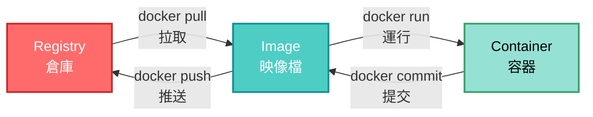

# 第一部分
## 基礎概念介紹

<div class="text-xl opacity-80 pt-4">
預計時間：30 分鐘
</div>

---

# 什麼是容器化技術？
## 現代應用程式部署的新典範

<div class="pt-6">

容器化是一種**軟體打包與部署技術**，將應用程式及其所有相依套件封裝在一個獨立、可移植的容器中。

<v-clicks>

### 🎯 核心特點

- **輕量化**：比傳統虛擬機更小、更快
- **可移植性**：一次打包，到處運行
- **一致性**：開發、測試、生產環境完全相同
- **隔離性**：每個容器獨立運行，互不干擾

</v-clicks>

</div>

<!--
容器化技術是近年來最重要的技術革新之一。
它解決了「在我電腦上可以運行」的經典問題。

重點強調：
- 容器不是虛擬機，它更輕量
- 容器包含了應用程式運行所需的一切
-->

---
layout: two-cols
---

# 傳統部署 vs 容器化部署
## 部署方式的演進

::left::

### 🏢 傳統部署方式

<v-clicks>

```
┌─────────────────┐
│   應用程式 A     │
├─────────────────┤
│   應用程式 B     │
├─────────────────┤
│   相依套件       │
├─────────────────┤
│   作業系統       │
├─────────────────┤
│   實體伺服器     │
└─────────────────┘
```

**問題：**
- ❌ 環境配置複雜
- ❌ 相依性衝突
- ❌ 難以擴展
- ❌ 資源浪費

</v-clicks>

::right::

### 🐳 容器化部署方式

<v-clicks>

```
┌────────┬────────┬────────┐
│ 容器 A  │ 容器 B │ 容器 C │
├────────┼────────┼────────┤
│ App A  │ App B  │ App C  │
│ + Deps │ + Deps │ + Deps │
├────────┴────────┴────────┤
│   Docker Engine          │
├──────────────────────────┤
│   作業系統               │
├──────────────────────────┤
│   實體/虛擬伺服器        │
└──────────────────────────┘
```

**優勢：**
- ✅ 環境一致性
- ✅ 隔離性佳
- ✅ 易於擴展
- ✅ 資源利用率高

</v-clicks>

<!--
左側展示傳統部署的問題：
- 所有應用共用同一個環境
- 套件版本衝突很常見
- 一個應用出問題可能影響其他應用

右側展示容器化的優勢：
- 每個應用都有自己獨立的環境
- 彼此完全隔離
- 更容易管理和擴展
-->

---

# Docker 解決的問題（一）
## 😰 傳統開發的困擾

<div class="pt-8">

<v-clicks>

```bash
開發者 A：「在我電腦上可以運行啊！」
```

**常見問題：**
- Python 版本不同（3.8 vs 3.11）
- 套件版本衝突
- 作業系統差異（Windows/Mac/Linux）
- 環境變數設定不同

**結果：** 花費大量時間解決環境問題 😫

</v-clicks>

</div>

<!--
傳統開發環境的經典問題：

「在我電腦上可以運行」是軟體開發中最常聽到的一句話。

常見問題來源：
- 不同開發者使用不同版本的 Python、Node.js 等
- 套件版本不一致導致功能異常
- Windows、Mac、Linux 環境差異
- 環境變數設定遺漏或不同

這些問題會：
- 浪費大量時間在環境除錯
- 降低團隊協作效率
- 增加新人上手難度
-->

---

# Docker 解決的問題（一）
## 🎉 Docker 的解決方案

<div class="pt-6">

<v-clicks>

```dockerfile
FROM python:3.11
COPY requirements.txt .
RUN pip install -r requirements.txt
COPY . .
CMD ["python", "app.py"]
```

**優勢：**
- ✅ 環境完全一致
- ✅ 一次配置，到處運行
- ✅ 新成員快速上手
- ✅ 減少環境除錯時間

**結果：** 專注於開發功能，不是修環境 🚀

</v-clicks>

</div>

<!--
這是 Docker 最重要的價值之一。

真實案例：
- 開發環境是 Mac
- 測試環境是 Ubuntu
- 生產環境是 CentOS
- 有了 Docker，這些都不是問題

重點：
- Dockerfile 定義了完整的環境
- 任何人在任何地方都能得到相同的環境
-->

---

# Docker 解決的問題（二）
## 🔒 應用程式隔離

<div class="pt-8">

<v-clicks>

```
容器 A (Node.js 18)
  ↓
獨立的檔案系統
獨立的網路空間
獨立的處理程序

容器 B (Node.js 20)
  ↓
完全不會互相干擾！
```

**隔離層面：**
- 📁 檔案系統隔離
- 🌐 網路隔離
- 💾 處理程序隔離
- 👤 使用者權限隔離

</v-clicks>

</div>

<!--
隔離性是容器技術的核心優勢之一。

隔離性的好處：
- 一個容器當機不會影響其他容器
- 可以在同一台機器上運行不同版本的應用
- 安全性更高（容器被入侵不會直接影響主機）
-->

---

# Docker 解決的問題（三）
## ⚙️ 資源管理

<div class="pt-8">

<v-clicks>

```yaml
# docker-compose.yml
services:
  web:
    deploy:
      resources:
        limits:
          cpus: '0.5'
          memory: 512M
        reservations:
          memory: 256M
```

**可控制的資源：**
- 🔢 CPU 使用率限制
- 💾 記憶體上限設定
- 💿 磁碟 I/O 限制
- 🌐 網路頻寬控制

</v-clicks>

</div>

<!--
資源管理的重要性：
- 防止某個應用吃掉所有資源
- 確保關鍵服務有足夠資源
- 更好的成本控制
- 提供可預測的應用效能
-->

---

# Docker 解決的問題（四）
## 🚀 快速部署

<div class="pt-8">

<v-clicks>

**傳統部署流程：**
```bash
1. 安裝作業系統           (30-60 分鐘)
2. 安裝相依套件           (20-30 分鐘)
3. 配置環境變數           (10-20 分鐘)
4. 部署應用程式           (10-15 分鐘)
5. 測試與除錯            (30-60 分鐘)

總計：約 2-3 小時 ⏰
```

**Docker 部署流程：**
```bash
docker compose up -d

總計：約 1-5 分鐘 🎉
```

</v-clicks>

</div>

<!--
快速部署是 Docker 的殺手級功能。

真實案例：
- 新同事加入團隊，5 分鐘內就能啟動完整開發環境
- 需要緊急擴展服務時，幾分鐘內就能增加新的容器實例
- 災難恢復時，可以快速在新伺服器上重建服務
- 從傳統的數小時部署縮短到數分鐘
-->

---

# Docker 解決的問題（五）
## 🌍 輕鬆移植

<div class="pt-8">

<v-clicks>

**跨平台部署：**

```bash
# 本地開發環境
docker compose up

# 推送到 Docker Hub
docker push myapp:v1.0

# 在任何伺服器上部署
docker pull myapp:v1.0
docker compose up -d
```

**支援的平台：**
- 💻 本地電腦（Windows/Mac/Linux）
- ☁️ 雲端平台（AWS/GCP/Azure）
- 🏢 私有伺服器
- 🎯 邊緣運算裝置

</v-clicks>

</div>

<!--
移植性的價值：
- 開發環境和生產環境完全一致
- 可以輕鬆在不同雲端平台間遷移
- 避免被特定平台綁定
- 一次打包，到處運行的真正實現
-->

---
layout: center
class: text-center
---

# 🎯 重點回顧
## 容器化技術的三大優勢

<div class="grid grid-cols-3 gap-8 pt-12">

<div v-click>

### 🎯 環境一致性

一次配置
到處運行

**告別「在我電腦上可以運行」**

</div>

<div v-click>

### 🔒 隔離性

應用獨立
資源可控

**安全、穩定、高效**

</div>

<div v-click>

### ⚡ 快速部署

秒級啟動
輕鬆移植

**從數小時到數分鐘**

</div>

</div>

<div v-click class="pt-12 text-2xl text-green-400">
接下來，我們將深入了解 Docker 的核心概念！
</div>

<!--
第一部分第一節總結：

容器化技術解決了三個核心問題：
1. 環境一致性 - 開發、測試、生產環境完全相同
2. 隔離性與資源管理 - 應用獨立運行，資源可控
3. 快速部署與移植 - 大幅縮短部署時間，輕鬆跨平台

這些優勢使得 Docker 成為現代應用部署的首選方案。

準備好進入下一個主題：Docker 核心概念！
-->

---
layout: section
class: text-center
---

# Docker 核心概念
## 深入理解 Image、Container、Registry

<div class="pt-6 text-xl opacity-80">
了解 Docker 的三大核心元件
</div>

<!--
進入第二節：Docker 核心概念

這一節將介紹 Docker 的三大核心概念：
1. Image (映像檔)
2. Container (容器)
3. Registry (倉庫)

理解這三個概念是使用 Docker 的基礎。
-->

---

# Docker Image (映像檔)
## 📦 應用程式的打包模板

<div class="grid grid-cols-2 gap-8 pt-6">

<div>

<v-clicks>

### 什麼是 Image？

**Image 是一個唯讀的模板**，包含了運行應用程式所需的所有內容：

- 📋 應用程式的程式碼
- 🔧 執行環境（如 Python、Node.js）
- 📚 相依套件和函式庫
- ⚙️ 設定檔案
- 🔨 執行指令

</v-clicks>

</div>

<div>

<v-clicks>

### 特性

- ✅ **唯讀**：建立後不可修改
- ✅ **分層架構**：多個層疊加組成
- ✅ **可共享**：可以推送到 Registry 供他人使用
- ✅ **版本控制**：使用標籤（tag）管理不同版本

</v-clicks>

</div>

</div>

<!--
Image 是 Docker 的核心概念之一。

比喻：
- Image 就像是一個「軟體快照」
- 包含了應用程式運行所需的一切
- 可以從這個模板創建多個容器

重點強調：
- Image 是唯讀的，創建後不會改變
- Image 是分層的，可以共享基礎層以節省空間
- 每個 Image 可以有多個版本（tag）
-->

---

# Docker Container (容器)
## 🚀 Image 的運行實例

<div class="grid grid-cols-2 gap-8 pt-6">

<div>

<v-clicks>

### 什麼是 Container？

**Container 是 Image 的運行實例**，是一個獨立的運行環境：

- 🎯 從 Image 啟動而來
- 💾 有自己的可寫層
- 🔄 可以啟動、停止、刪除
- 📝 每個 Container 都是獨立的

</v-clicks>

</div>

<div>

<v-clicks>

### 特性

- ✅ **可讀寫**：容器運行時可以修改檔案
- ✅ **隔離性**：每個容器獨立運行
- ✅ **輕量級**：秒級啟動
- ✅ **臨時性**：刪除容器後，未持久化的資料會消失

</v-clicks>

</div>

</div>

<!--
Container 是 Image 的具體實現。

關鍵概念：
- Container 是動態的，Image 是靜態的
- 一個 Image 可以創建多個 Container
- 容器之間完全隔離
- 容器刪除後，內部修改的資料會消失（除非使用 volumes）

實際應用：
- 可以同時運行多個相同 Image 的容器
- 例如：使用同一個 nginx Image 啟動 3 個 web 服務容器
-->

---

# Docker Registry (倉庫)
## 🏪 Image 的儲存與分享中心

<div class="grid grid-cols-2 gap-8 pt-6">

<div>

<v-clicks>

### 什麼是 Registry？

**Registry 是存放和分發 Image 的伺服器**：

- 🌐 **公開倉庫**：Docker Hub（最大的公開 Registry）
- 🔒 **私有倉庫**：企業內部的 Registry
- 📤 **推送 (Push)**：上傳 Image 到 Registry
- 📥 **拉取 (Pull)**：從 Registry 下載 Image

</v-clicks>

</div>

<div>

<v-clicks>

### 常見的 Registry

| Registry | 說明 | 使用場景 |
|----------|------|----------|
| Docker Hub | 官方公開倉庫 | 開源專案、公開映像 |
| GitHub Container Registry | GitHub 的容器倉庫 | 與 GitHub 專案整合 |
| Google Container Registry | Google Cloud 的倉庫 | GCP 部署 |
| 私有 Registry | 自架的倉庫 | 企業內部使用 |

</v-clicks>

</div>

</div>

<!--
Registry 是 Docker 生態系統的重要組成部分。

Docker Hub：
- 類似於 GitHub，但是專門存放容器映像
- 可以找到大量的官方和社群維護的 Image
- 例如：nginx, mysql, node, python 等

實際操作：
- docker pull：從 Registry 下載 Image
- docker push：上傳 Image 到 Registry
- 預設情況下，docker pull 會從 Docker Hub 下載

企業使用：
- 通常會架設私有 Registry 來存放內部應用的 Image
- 可以更好地控制安全性和訪問權限
-->

---

# Image、Container、Registry 的關係
## 三者如何協同運作

<div class="pt-4">



<div class="grid grid-cols-3 gap-6 pt-8">

<div v-click>

### 📥 拉取階段
```bash
docker pull nginx:latest
```
從 Registry 下載 Image

</div>

<div v-click>

### 🚀 運行階段
```bash
docker run -d nginx:latest
```
從 Image 創建 Container

</div>

<div v-click>

### 📤 分享階段
```bash
docker push myapp:v1.0
```
上傳 Image 到 Registry

</div>

</div>

</div>

<!--
這張圖展示了三者的關係和工作流程。

典型工作流程：
1. 從 Registry 拉取 Image（docker pull）
2. 從 Image 運行 Container（docker run）
3. 修改後提交為新 Image（docker commit）
4. 推送 Image 到 Registry（docker push）

實際應用場景：
- 開發人員在本地開發，創建 Image
- 推送到公司的私有 Registry
- 其他團隊成員或部署伺服器拉取 Image
- 在各自環境中運行 Container

重點：
- Registry 是中央倉庫
- Image 是靜態模板
- Container 是運行實例
-->

---

# 生活化比喻
## 🏠 用建築來理解 Docker

---

# 📋 Image = 建築藍圖
## 靜態的設計文件

<div class="grid grid-cols-2 gap-8 pt-8">

<div>

<v-clicks>

```
🏗️ 現代住宅藍圖
---
- 樓層數：3 層
- 房間數：5 間
- 結構規格
- 水電配置
- 裝修標準
```

### 特點

- ✅ **唯讀**：設計完成後不會改變
- ✅ **可複製**：可以分享給建商
- ✅ **可重用**：可以蓋出多棟相同的房子
- ✅ **版本控制**：可以有不同版本的設計

</v-clicks>

</div>

<div>

<v-clicks>

### 對應 Docker

**Image** 就是應用程式的完整藍圖：

- 📋 **程式碼**: 應用程式源代碼

- 🔧 **執行環境**: .NET, Python、Node.js、Java 等

- 📚 **相依套件**: 所有函式庫和依賴

- ⚙️ **設定檔案**: 環境變數、配置等

**全部封裝在一個不可改變的模板中**

</v-clicks>

</div>

</div>

---

# 🏘️ Container = 實際的房子
## 動態的運行實體

<div class="grid grid-cols-2 gap-8 pt-8">

<div>

<v-clicks>

```
🏠 根據藍圖蓋好的房子
---
狀態：正在使用

特點：
- 這是「這一棟」實際房子
- 可以自由裝飾佈置
- 可以住人、改造
- 每次蓋可能略有差異
```

### 特點

- ✅ **可讀寫**：蓋好後，可以自由使用
- ✅ **隔離性**：每棟房子獨立存在，互不干擾
- ✅ **易於拆除**：可以拆除，不影響藍圖本身
- ✅ **可複數**：同一藍圖可以蓋多棟房子

</v-clicks>

</div>

<div>

<v-clicks>

### 對應 Docker

**Container** 是 Image 的運行實例：

- 🚀 **從 Image 啟動而來**: docker run 命令

- 💾 **有自己的可寫層**: 可以修改檔案和狀態

- 🔄 **可以啟動、停止、刪除**: 動態生命週期

- 🔒 **相互完全隔離**: 獨立的檔案系統、網路，一個容器故障不影響其他

</v-clicks>

</div>

</div>

---

# 🏢 Registry = 藍圖分享平台
## 集中存放和分享

<div class="grid grid-cols-2 gap-8 pt-8">

<div>

<v-clicks>

### 就像建築藍圖的線上平台

想像有個網站集中存放各種建築藍圖：
- 建築師上傳自己設計的藍圖
- 建商下載需要的藍圖
- 大家可以討論、改進、分享

### 主要功能

- 📤 **上傳（Push）**：分享自己的藍圖
- 📥 **下載（Pull）**：取得別人的藍圖
- 🌐 **公開分享**：開源的、免費的藍圖
- 🔒 **私密版本**：企業內部專用的藍圖

</v-clicks>

</div>

<div>

<v-clicks>

### 對應 Docker

**Registry** 是存放和分享 Image 的伺服器：
- 🐳 **Docker Hub**: 官方公開倉庫，最大的映像檔數據庫

- 🔒 **私有 Registry**: 企業內部倉庫，完全掌控資料

- 🌐 **其他選項**: Azure, Google, GitHub Container Container Registry

</v-clicks>

</div>

</div>

<!--
房子比喻的優勢：

Image（建築藍圖）：
- 是一個靜態的設計文件
- 任何人按照這個藍圖都能蓋出相同的房子
- 藍圖本身不會改變，但可以有不同版本

Container（實際的房子）：
- 是根據藍圖蓋出來的動態實體
- 可以自由裝飾、改造、使用
- 拆除容器不會影響藍圖
- 同一個藍圖可以蓋多棟房子

Registry（藍圖分享平台）：
- 集中存放大量藍圖
- 可以上傳、下載、分享
- 有公開和私密的版本
- 企業或個人都可以發佈

延伸應用：
- Volume = 外接儲藏室（持久化存儲）
- Network = 房子之間的道路（容器通訊）

這個比喻直觀易懂，有助於學員快速掌握 Docker 的核心概念。
-->
